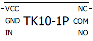

# Electrical diagrams

Electrical diagrams realized with QElectroTech.

## Sensors

| Device  | Preview |
| --- | --- |
| DS18B20  |  |

## Actuators

| Device  | Preview |
| --- | --- |
| TK10-1P |  |

## Arduino boards

| Device  | Preview |
| --- | --- |
| Leonardo  |  |
