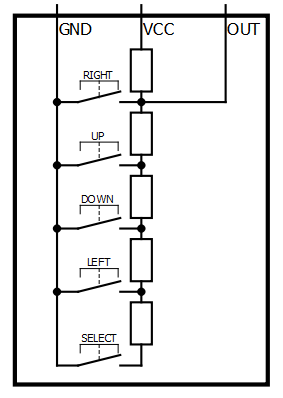
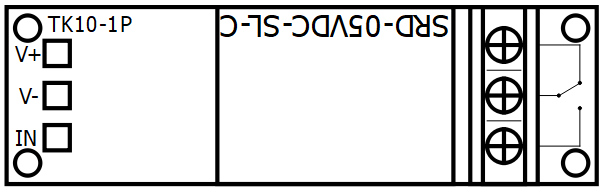
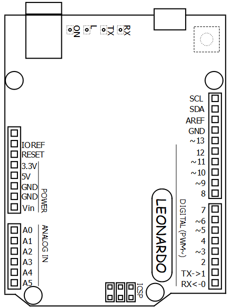

# Electrical diagrams

Electrical diagrams realized with QElectroTech.

## Sensors

| Device  | Preview |
| --- | --- |
| DS18B20  |  |
|  5 buttons keypad |  |

## Actuators

| Device  | Preview |
| --- | --- |
| TK10-1P |  |
| LCD 1602A |  |

## Arduino boards

| Device  | Preview |
| --- | --- |
| Leonardo  |  |
